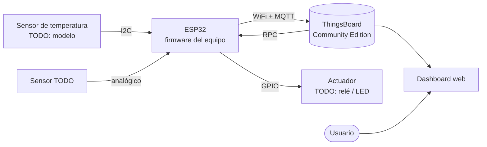
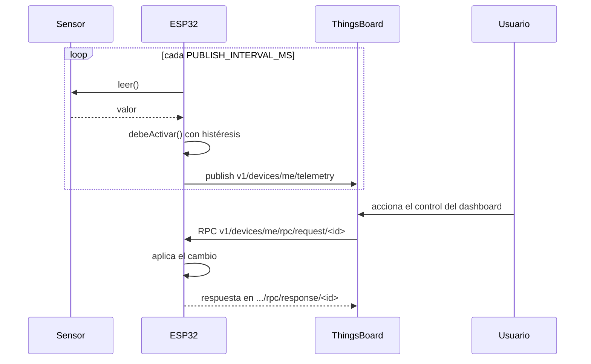
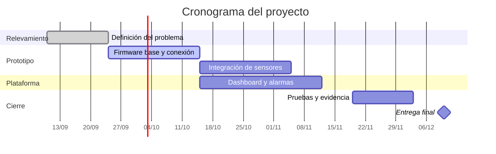

# Arquitectura

!!! note "Cómo se usa esta página"
    Acá va **cómo** está armado el sistema. El **por qué** va en
    [Decisiones](decisiones.md). Si te encontrás justificando una elección,
    esa parte va en la otra página.

## Diagrama de bloques

TODO: ajustá el diagrama a tu proyecto. Este es un ejemplo funcionando: si lo
ves como texto en vez de como dibujo, algo se rompió en `mkdocs.yml`.



## Flujo de datos

TODO: revisá que estos pasos coincidan con tu firmware.

1. Cada `PUBLISH_INTERVAL_MS` (5 s por defecto), el firmware lee los sensores.
2. Con esa lectura decide el estado del actuador aplicando **histéresis**
   (`lib/control/`), salvo que el modo manual esté activo.
3. Arma un JSON y lo publica por MQTT en el tópico de telemetría.
4. ThingsBoard almacena la telemetría y la muestra en el dashboard.
5. Si el usuario acciona un control del dashboard, ThingsBoard envía una
   llamada RPC que el firmware atiende y responde.



## Contrato JSON de la telemetría

Esto es un **contrato**: los widgets del dashboard de ThingsBoard buscan estos
nombres de campo exactos. Si renombrás uno, los widgets dejan de mostrar datos
y no avisan. Cambiar este contrato implica actualizar el dashboard y esta
tabla, en el mismo commit.

Tópico: `v1/devices/me/telemetry`

```json
{
  "temperatura": 27.4,
  "actuador": true,
  "modo": "automatico",
  "rssi": -63
}
```

| Campo | Tipo | Unidad | Rango esperado | Qué significa |
|---|---|---|---|---|
| `temperatura` | número | °C | -40 a 85 | Lectura del sensor. Fuera de ese rango se considera falla de sensor |
| `actuador` | booleano | — | `true` / `false` | Estado real del actuador en el momento de publicar |
| `modo` | texto | — | `automatico` \| `manual` | Si manda la histéresis o una orden del dashboard |
| `rssi` | entero | dBm | -90 a -30 | Potencia de la señal WiFi. Sirve para descartar problemas de cobertura |

TODO: agregá una fila por cada campo que sumen, y sacá los que no usen.

!!! tip "Por qué documentar el `rssi`"
    No es parte del problema que resuelven, pero cuando la telemetría se corta
    a ratos, es el primer dato que dice si el problema es la red o el
    dispositivo. Vale la pena publicar algún dato de salud del sistema.

## Contrato de las llamadas RPC

Tópico de entrada: `v1/devices/me/rpc/request/<id>` ·
Respuesta: `v1/devices/me/rpc/response/<id>`, con el mismo `<id>`.

| Método | Parámetros | Qué hace | Respuesta |
|---|---|---|---|
| `setEstado` | booleano | Fuerza el actuador y pasa a modo manual | `{"estado": bool, "modo": "manual"}` |
| `getEstado` | — | Consulta el estado actual | `{"estado": bool, "modo": "..."}` |
| `setAuto` | — | Vuelve al control automático por histéresis | `{"modo": "automatico"}` |

TODO: agregá los métodos propios de tu proyecto.

## Entidades de ThingsBoard

| Entidad | Cómo la usamos |
|---|---|
| Dispositivo | TODO: uno por prototipo. Nombre, y tipo de dispositivo si crearon uno |
| Access token | Credencial del dispositivo. Va en `secrets.ini`, nunca en el código |
| Telemetría | Las series temporales de la tabla de más arriba |
| Atributos | TODO: si usan atributos compartidos para configurar el dispositivo, documentá cuáles |
| Dashboard | TODO: nombre del dashboard y qué widgets tiene |
| Alarma / regla | TODO: si configuraron una regla de alarma, describila acá |

## Decisiones de conexión

| Aspecto | Valor | Dónde se configura |
|---|---|---|
| Protocolo | MQTT sobre TLS | `TB_PUERTO` en `include/config.h` |
| Puerto | 8883 | ídem |
| Autenticación | Access token del dispositivo como *username* de MQTT, contraseña vacía | `include/config.h` |
| Intervalo de publicación | 5 s | `PUBLISH_INTERVAL_MS` |
| Buffer MQTT | 512 bytes | `MQTT_BUFFER_SIZE` |

!!! warning "Sobre el cifrado: qué protege y qué no"
    Toda la comunicación va cifrada por el 8883. El puerto 1883, sin cifrar,
    está cerrado en el servidor del curso: por ahí el access token viajaría en
    claro y cualquiera en la misma red podría leerlo.

    Ahora bien, el firmware llama a `setInsecure()`, que cifra la conexión pero
    **no verifica la identidad del servidor**: no comprueba que del otro lado
    esté realmente ThingsBoard y no alguien haciéndose pasar por él. El token
    viaja protegido, que es lo que importa acá, pero **cifrado y autenticado
    son cosas distintas**.

    Verificar la cadena completa de certificados exige guardarla en la placa y
    consume memoria que al ESP8266 le sobra poca. Si alguna vez llevan esto a
    producción, ese es el paso que falta.

## Cronograma

TODO: ajustá las fechas y las tareas a tu proyecto.


