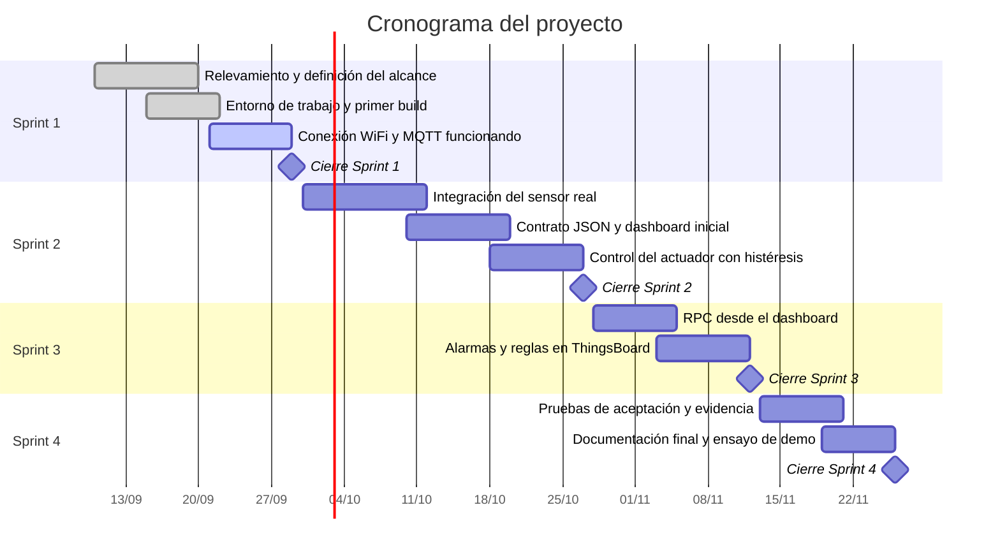

# Plan

El cronograma del proyecto y el seguimiento de cada sprint.

!!! note "Este es el mismo Gantt que entregaron en el anteproyecto"
    No es un diagrama nuevo: es aquel, traído acá y versionado. La diferencia
    es que ahora vive en git, así que cada vez que lo ajusten queda registrado
    **qué cambió y cuándo**:

    ```bash
    git log -p docs/plan.md
    ```

    Un plan que se movió tres veces no es un problema —los proyectos se
    mueven—. El problema es un plan que se movió tres veces sin que quede
    rastro de por qué. La tabla de abajo es para eso.

## Fechas de los sprints

| Sprint | Cierre |
|---|---|
| Sprint 1 | 29/09/2026 |
| Sprint 2 | 27/10/2026 |
| Sprint 3 | 12/11/2026 |
| Sprint 4 | 26/11/2026 |

## Cronograma

TODO: reemplazá las tareas de ejemplo por las de tu proyecto. Las fechas de
cierre de sprint (los hitos) son las reales del curso: esas no se tocan.



## Seguimiento por sprint

Se completa al cerrar cada sprint, no antes. La columna que más importa es la
última: es donde queda escrito el motivo de cada cambio de plan.

| Sprint | Qué nos comprometimos | Qué logramos | Qué movimos y por qué |
|---|---|---|---|
| Sprint 1 | | | |
| Sprint 2 | | | |
| Sprint 3 | | | |
| Sprint 4 | | | |

!!! tip "Cómo llenar la última columna"
    Sirve cuando dice qué se movió, adónde, y qué lo causó. Comparen:

    - *"Nos atrasamos con el sensor."* — no dice nada.
    - *"El DHT22 llegó una semana tarde, así que la integración del sensor pasó
      al Sprint 2 y adelantamos el dashboard, que no dependía del hardware."* —
      eso explica el plan y muestra que hubo una decisión.
